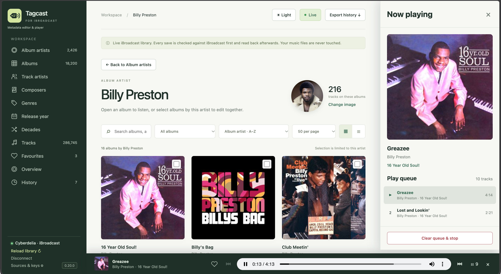
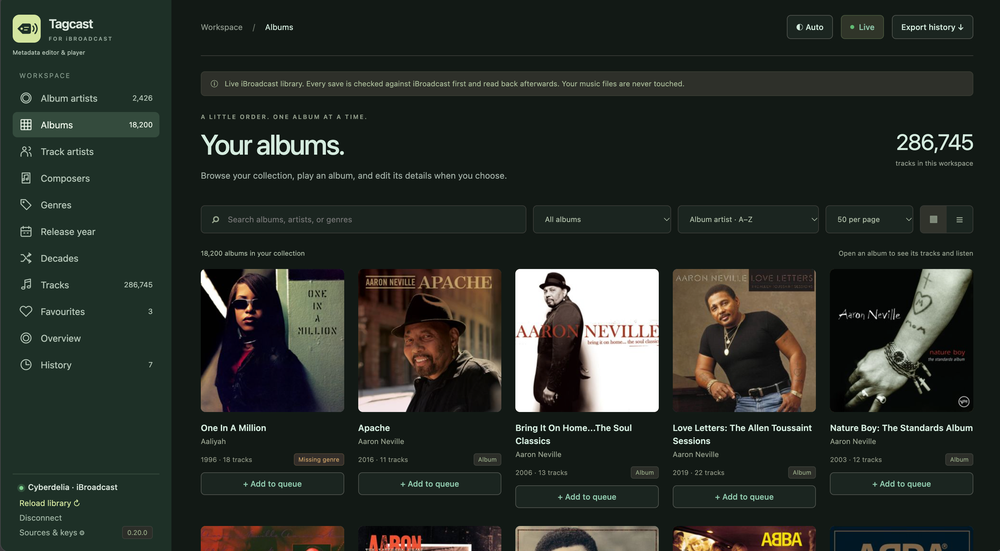
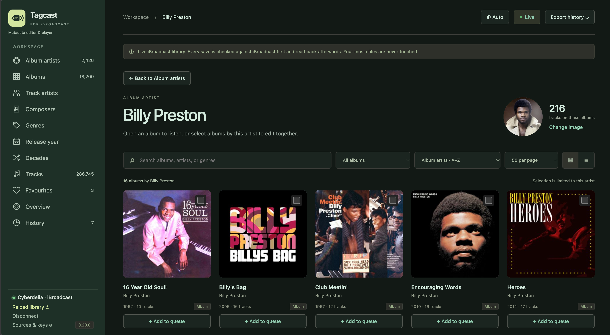
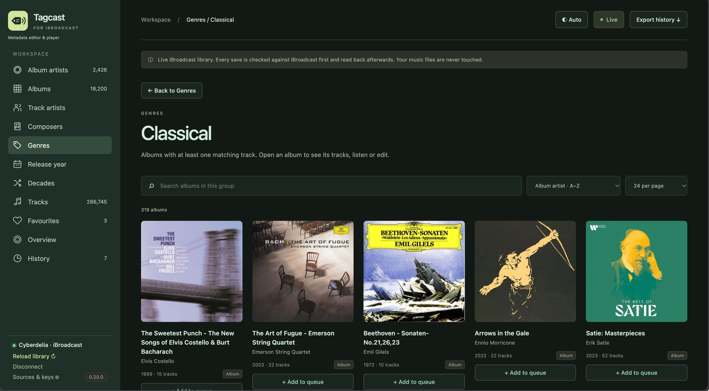
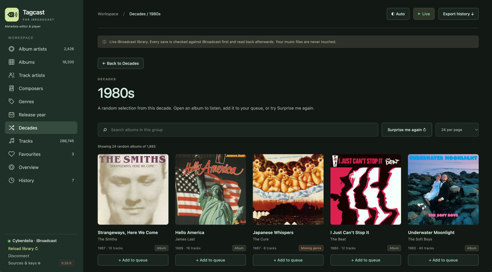
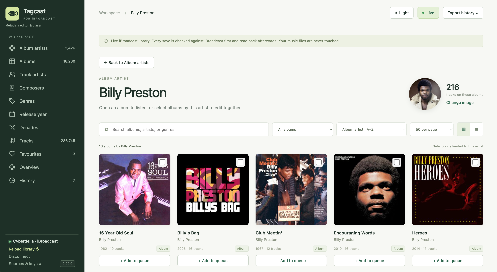

<p align="center"></p>

<h1 align="center">Tagcast</h1>
<p align="center"><b>Metadata editor &amp; player for iBroadcast.</b></p>
<p align="center"><a href="https://github.com/cyberdeliaAI/tagcast/actions/workflows/tests.yml"></a> <a href="LICENSE"></a></p>

Browse, discover and play your [iBroadcast](https://www.ibroadcast.com/) collection. Fix metadata, find album covers and artist images, review your changes, then save them to iBroadcast.

Tagcast runs on your computer, with its interface in your browser. **Your local music files are never changed.** It listens on `127.0.0.1` only.

**New in [0.20.0](https://github.com/cyberdeliaAI/tagcast/releases/tag/v0.20.0):** Now playing with a large cover, a play queue for tracks and albums, random discoveries by decade, Track artists / Composers / Genres / Release year overviews, native iBroadcast favourites, update notifications and a compact sidebar with a mobile menu. Standalone downloads include everything needed to run Tagcast.

[Install](#install) · [Connect iBroadcast](#connect-ibroadcast) · [Using Tagcast](#using-tagcast) · [Screenshots](#screenshots) · [Update](#updating-tagcast)


> Tagcast is an independent project. It is not made or endorsed by iBroadcast.

## Install

### Standalone downloads — no Python required

Open the [latest release](https://github.com/cyberdeliaAI/tagcast/releases/latest) and download the archive for your computer under **Assets**. These are the **0.20.0** packages:

| System | Download | Start |
|---|---|---|
| macOS, Apple Silicon | [tagcast-0.20.0-macos-arm64.zip](https://github.com/cyberdeliaAI/tagcast/releases/download/v0.20.0/tagcast-0.20.0-macos-arm64.zip) | Extract `Tagcast.app`, move it to Applications and open it. |
| macOS, Intel | [tagcast-0.20.0-macos-x64.zip](https://github.com/cyberdeliaAI/tagcast/releases/download/v0.20.0/tagcast-0.20.0-macos-x64.zip) | Extract `Tagcast.app`, move it to Applications and open it. |
| Windows, x64 | [tagcast-0.20.0-windows-x64.zip](https://github.com/cyberdeliaAI/tagcast/releases/download/v0.20.0/tagcast-0.20.0-windows-x64.zip) | Extract the whole archive, then open `Tagcast.exe` in the extracted folder. |
| Linux, x64 | [tagcast-0.20.0-linux-x64.tar.gz](https://github.com/cyberdeliaAI/tagcast/releases/download/v0.20.0/tagcast-0.20.0-linux-x64.tar.gz) | Extract with `tar -xzf tagcast-0.20.0-linux-x64.tar.gz`, then run `./Tagcast` inside the extracted `Tagcast` folder. |

On a Mac, **About This Mac** tells you whether you have an Apple chip or an Intel processor. Linux needs a graphical desktop and glibc 2.35 or newer. Keep the Windows/Linux executables and `_internal` folder together; keep the macOS app's Contents intact.

A small launcher window opens Tagcast in your default browser at <http://127.0.0.1:8912>. If the browser does not open, use **Open Tagcast in browser** in the launcher. **Keep the launcher open while using Tagcast.** Choose **Stop Tagcast and close** or close the launcher to stop the server it started. Closing just the browser tab does not stop Tagcast. If the launcher reused a server that was already running, closing it leaves that server running.

The downloads are not Developer ID signed/notarized on macOS or Authenticode signed on Windows. If your operating system blocks opening one, use **System Settings → Privacy & Security → Open Anyway** on macOS, or **More info → Run anyway** on Windows.

Each archive has a separate `.sha256` checksum file under Assets. See the [standalone guide](docs/native-builds.md) for checksum verification, the separate CLI and platform requirements. GitHub's **Source code** archives are for the source installation below.

<details>
<summary><b>Run from source with Python or uv</b></summary>

Download and extract **Source code (zip)** from the release, or clone this repository:

```bash
git clone https://github.com/cyberdeliaAI/tagcast.git
cd tagcast
```

You need [uv](https://docs.astral.sh/uv/) or **Python 3.11 or newer**. In the extracted/cloned folder, start the script for your system:

| System | Start script |
|---|---|
| macOS | Double-click `start-tagcast.command` (right-click → Open if macOS asks). |
| Windows | Double-click `start-tagcast.bat`. |
| Linux | Run `./start-tagcast.sh`. |

The scripts use uv when available. Otherwise they create a `.venv` beside the script and install Tagcast on the first start. Set `TAGCAST_NO_UV=1` to use the Python fallback explicitly. Keep the terminal window open; Ctrl+C stops the server it started. Starting another copy opens the existing Tagcast.

Or run it directly from a terminal in the source folder:

**With uv:**

```bash
uv run --frozen tagcast --open
```

**With Python on macOS/Linux:**

```bash
python3 -m venv .venv
.venv/bin/python -m pip install -e .
.venv/bin/tagcast --open
```

**With Python on Windows (PowerShell):**

```powershell
py -3 -m venv .venv
.\.venv\Scripts\python.exe -m pip install -e .
.\.venv\Scripts\tagcast.exe --open
```

Use `--port 8913` to choose another local port, for example `uv run --frozen tagcast --port 8913 --open`.

</details>

## Connect iBroadcast

Without an account, Tagcast opens a **demo library** so you can try browsing and preview metadata edits. Demo edits are never saved to iBroadcast. Playback, the play queue and favourites need a live connection.

### 1. Create your own iBroadcast app (once)

Tagcast signs in through an app you register in your own iBroadcast account. You approve its access on the iBroadcast website; Tagcast does not ask for your iBroadcast password.

1. Open [media.ibroadcast.com](https://media.ibroadcast.com/) and sign in.
2. Click **your name at the top right** and choose **Apps**.
3. Scroll to the **bottom** of the Apps page. Under **Developers**, click the **developer** link.
4. Next to **Your Apps**, click **+**. Give the app a name, such as *Tagcast*, and a short description, then save it.
5. Open your new app and copy its **client ID**. The client secret is not needed.

An app you made yourself works for your own account without requesting a review.

<details>
<summary>Where to find Apps, Developers and Your Apps</summary>

**Account menu → Apps**


**Bottom of the Apps page → developer**


**Your Apps → +**


</details>

### 2. Sign in from Tagcast

1. In Tagcast, click **Connect iBroadcast**.
2. Paste the client ID and click **Save**.
3. Choose **Sign in with a code**, then **Open iBroadcast sign-in**.
4. Enter the displayed code if asked, and approve Tagcast on the iBroadcast page.
5. Return to Tagcast. Your library loads automatically, and the sidebar shows your account name with a green connection dot.

The first download of a large library can take a little while. Later starts reuse a local cache when iBroadcast reports no changes. **Reload library** checks for changes; **Download everything again** in the connection dialog forces a fresh download.

For browser redirect sign-in instead, add `http://127.0.0.1:8912/callback` as a redirect URI in your iBroadcast app, then choose **Use browser redirect**. If you use a different port, use that port in the redirect URI too.

The client ID, tokens and cache stay in `~/.tagcast/` (`.tagcast` in your user folder on Windows). Set `TAGCAST_HOME` to use another folder. Settings from the earlier `~/.library-studio/` folder are migrated on first start. **Disconnect** revokes the token and removes the local library cache. Source users can also supply `IBROADCAST_CLIENT_ID` as an environment variable.

## Using Tagcast

### Browse and discover

Tagcast starts on **Album artists**. Choose an artist to see their albums, or use **Albums** to browse the whole collection. Search, filter, sort, and switch between covers and a compact list. Choose **24, 50, 100 or 200 items per page**; Tracks and Favourites offer 50, 100 or 200.

| Page | What you can do |
|---|---|
| **Album artists** | Search artists, see their photos and album counts, or filter those without an image. Open an artist's albums and select several of their albums to edit together. |
| **Track artists / Composers** | Find albums featuring a performer or composer, with album and track counts. Stored iBroadcast artist IDs determine membership. |
| **Genres** | Browse main and additional genres. Click a genre on an album to open the same group. Combined labels such as `Pop;Rock` stay as stored until you choose to split them in the editor. |
| **Release year** | Browse albums by track year, falling back to album year. Tracks without either appear under **Unknown year**. |
| **Decades** | Choose a period such as **1980s** for a random selection of albums. **Surprise me again** gives you another selection; use the page-size control to choose how many to show. |
| **Tracks** | Search every track by title, artist, album or composer. Case and accents do not matter: `bjork` finds Björk. Searches return at most 1,000 results. Open a result's album or play from that track. |

Track artist, composer, genre and year cards open **matching albums**, rather than a separate track list. One matching active track is enough to include an album. Multi-disc sets stay together and count as one album in these cards. Decades use the same year fallback and omit tracks with unknown years.

Album filters help you find missing years, genres, covers or composers; combined genres; artists without an image; albums with only 1–2 tracks; gaps in track numbering; duplicate titles; and named editions. **Next album** lets you work through a filtered collection.

Browser **Back** and **Forward** restore the page you came from, including its search, filters and page. Back also preserves a decade's random selection. **Auto**, **Light** and **Dark** themes are available; Auto follows your system. On a narrow screen, the hamburger menu keeps navigation, connection controls and source settings accessible.

### Listen, Now playing and the play queue

Open an album and choose **Play album**, or use ▶ beside a track to start there and continue through the album. Playback continues while you browse or edit another album.

| Control | What happens |
|---|---|
| **Play album / ▶ on a track** | Starts that album, from the chosen track, and replaces the existing queue. Clicking the already-current track toggles pause/play. |
| **+ Add to queue** on an album | Appends the entire album, including every disc of a set, without interrupting the current track. |
| **+** beside a track | Appends just that track. An empty queue starts playing when you add to it. |
| **Player cover / queue button** | Opens **Now playing** with a large cover, the current track and the full play queue. Click a queue entry to jump to it. |
| **Clear queue & stop** | Stops playback and removes the entire queue, including the current track. |

Use the player's previous/next buttons, seek bar and volume controls while browsing. Its album artist and album title link to their pages. A third line appears when the track artist differs; that name opens albums featuring that track artist.

The queue lives in the current browser page and resets when you reload it. It is not synced with iBroadcast's queue or saved as a playlist. Audio goes through Tagcast's local server, keeping the access token out of the page; supported audio formats depend on your browser. **Tagcast does not report play counts or Last.fm scrobbles.**



### Favourites

Click the **heart** on an album track, a track search result or the player to add or remove a favourite. **Favourites** gives you a searchable, paginated list of your liked tracks; you can play them or add them to the queue.

Favourites use **iBroadcast's native track ratings**: adding sets the rating to **5**, and removing clears it to **0**. Tracks rated 5 or higher are already included. Replacing a lower nonzero rating asks for confirmation first. These changes save directly, check the displayed rating against iBroadcast and read the result back. They are separate from metadata History and Undo.

### Edit metadata and artwork

1. Open an album and choose **Edit album**. Edit its title, album artist, release year or disc number, and genres or composers for its tracks. Individual tracks can also have their own title, artist, year, track number, genres and composers.
2. Use the online suggestions beside the form if helpful. Click a year or genre to fill the form, Shift-click a genre to add it, or choose **Use all** for the suggested genres. Suggestions do not save anything by themselves.
3. **Review** the before/after values, then choose **Save to iBroadcast**. Tagcast checks the existing values first and downloads the library again to confirm accepted writes. History shows the progress and result.

To edit several albums, open **one album artist**, tick their album cards and edit the selection. Only the fields you enable are changed. Album year changes leave track years alone unless you tick **Also apply the release year to tracks**; individual track edits take precedence over album-wide edits.

Genres are separate labels: the first is the main genre, and the others become additional genres. **Split** or **Split combined genres** explicitly separates labels such as `Pop;Rock`. Composers are stored as composer credits; other credits, such as featured artists, are preserved.

For covers and artist images, choose an online suggestion, existing iBroadcast artwork, your own file, a pasted image or an image URL. Compare old and new, then explicitly save the artwork. JPEG, PNG, WebP and GIF are supported, up to **15 MB**. Image URLs pointing to this computer or the local network are refused.

**Artwork Undo restores a previous image when one exists.** If an artist had no image before, Undo cannot remove the new image and explains that no previous image is available. Metadata edits, favourites and trash moves do not have automatic Undo. See [how saving stays safe](#how-saving-stays-safe) and [multi-disc sets](#combine-multi-disc-album-sets) below.

### Move tracks to trash

On an album page, choose **Move to trash…**, tick the tracks, review them and confirm. **Select extra copies** helps select repeated track titles; **Select all** selects the whole album. Duplicate detection compares titles, ignoring case and spacing; it does not compare the audio files.

Tagcast checks that the tracks are still active on that album, moves them to **iBroadcast's trash**, and reads the library back. It never deletes tracks permanently. Restore trashed tracks through iBroadcast; Tagcast cannot take them out of the trash. An album disappears from Tagcast when it has no active tracks left.

### Overview and History

**Overview** shows library totals, collection size, playing time, formats, uploads per year and iBroadcast's existing play counts. **Metadata health** links to albums with missing metadata or artwork. Account and iBroadcast settings are shown here too; settings such as **Combine Multi-Disc Album Sets** are changed on the iBroadcast website.

**History** stores saves and their results in this browser. Export it as JSON with **Export history**. **Clear history** asks for confirmation and removes the local entries, including their artwork Undo information; it does not revert saved changes in iBroadcast. Clearing is available after ongoing saves and read-back checks finish. History belongs to this browser and local address, so another browser or port has its own history.

## Updating Tagcast

Tagcast checks GitHub for a newer **stable release** at startup, at most once a day. A notification links to the release page. Use **Sources & keys → Tagcast updates** to check immediately or disable automatic checks. No account credentials or library data are sent to GitHub. Updates are downloaded and installed manually.

1. **Stop the old Tagcast first.** Close its desktop launcher, or stop its terminal server with Ctrl+C. Closing only the browser tab is not enough.
2. Download and extract the new package for your computer, then replace the old application/folder. Source users should update their checkout or use a freshly extracted source archive.
3. Start the new version. Your account settings, tokens and cache remain in `~/.tagcast/`, or your configured `TAGCAST_HOME`. Reload the browser page if it still shows the old interface.

If you start the new copy while the old server is still running, the launcher opens that existing server. The version at the bottom of the sidebar tells you which version you are using.

## Screenshots

All workspace screenshots here show **Tagcast 0.20.0**. The Album artists and Now playing views are shown above; expand the sections below for the other views.

<details>
<summary><b>Albums, an artist's collection and album details</b></summary>

**Albums:** search, filter, sort and add an album to the queue from its card.



**An album artist:** browse Billy Preston's albums, change the artist image or select albums by this artist to edit together.



**An album:** play it, add it to the queue, edit metadata or review a trash move. Each track has queue and favourite controls.


</details>

<details>
<summary><b>Metadata editing and online suggestions</b></summary>

The editor keeps album and track metadata alongside source suggestions. A suggested edition's release date may differ from the original release year; choose the values you want, then review before saving.


</details>

<details>
<summary><b>Genre browsing and decade discoveries</b></summary>

**Genres:** a genre opens matching albums, ready to play, queue or edit.



**Decades:** discover a random selection from the 1980s, or choose **Surprise me again** for another selection.



</details>

<details>
<summary><b>Overview and the light theme</b></summary>

**Overview:** collection totals and metadata health, with links to albums needing attention.


**Light theme:** the same browsing, selection and queue controls with light surfaces.



</details>

## Online sources and keys

MusicBrainz (with Cover Art Archive), Deezer, Apple Music (iTunes Search) and TheAudioDB work without a key. For the others, open **Sources & keys** in the sidebar:

| Source | What it adds | Key |
|---|---|---|
| Discogs | Styles and genres, original year, covers, artist images | Personal token: Discogs → Settings → Developers |
| Last.fm | Listener tags as genres, covers | API key: [last.fm/api/account/create](https://www.last.fm/api/account/create) |
| fanart.tv | Artist images | Personal API key: [fanart.tv/get-an-api-key](https://fanart.tv/get-an-api-key/) |

Keys are stored in `~/.tagcast/config.json` (readable by you only), or supplied through `DISCOGS_TOKEN`, `LASTFM_API_KEY` and `FANART_API_KEY`. Saved keys stay server-side and are never returned to the page. The Last.fm key is for metadata lookups, not scrobbling.

By default, opening an album's **editor** looks it up in the available sources. Turn automatic lookup off in **Sources & keys** if you prefer to press **Search** yourself. A lookup sends the artist and album name to each source. Requests are spaced per source and responses are cached for an hour.

Matching ignores case, accents, "The", and edition text such as "(2011 Remaster)" or "- Deluxe Edition"; each suggestion shows its title/artist match score. MusicBrainz and Discogs give the **first release** year. Deezer and Apple Music give the date of the edition they have, which may be a later remaster.

## Combine Multi-Disc Album Sets

**Keep this iBroadcast setting off.** Tagcast groups the discs itself while retaining the separate album records needed to save changes. You can change the setting on [media.ibroadcast.com](https://media.ibroadcast.com/), then reload your library in Tagcast.

- **Setting off:** discs with the same title and album artist and different disc numbers appear as one album in Tagcast. One card represents the set, with a CD icon per disc; its album page lists all discs, and Play/Add to queue includes them all. Duplicate disc numbers remain separate, as do different titles such as `Album (CD1)` and `Album (CD2)`.
- **Editing a set:** title, album artist, year, genres or composers apply across its discs. The review lists changes per disc because iBroadcast receives separate writes. Change a disc number individually with **Edit disc 2**, for example. A shared cover is uploaded once and applied disc by disc, with a History entry and available artwork Undo per disc. Each disc waits for the previous read-back.
- **Setting on:** iBroadcast combines disc records in the library it sends and refuses album changes. Tagcast warns in the review, can still save supported track changes, and marks album changes **Not sent · setting**. Turn the setting off, reload, and use **Review the rest again** in the results or History.

The library cache follows this setting, so changing it triggers a fresh download. **Overview uses iBroadcast's album totals**, counting separate discs when the setting is off; the sidebar and browsing cards count Tagcast's grouped albums. These totals can therefore differ.

## How saving stays safe

1. The server checks your library against iBroadcast and compares every **before** value. If something changed since you loaded it, the conflicting save is blocked and you are asked to reload. If iBroadcast reports no change, the in-memory copy is used; otherwise the library is downloaded first.
2. Artist names match existing artists by exact name first, then case-insensitively. A new name is flagged in the review and created only when you save.
3. Only changed, supported fields are sent. Saves are **not transactional**: if a request fails, later metadata requests stop, but earlier accepted changes may already have been applied.
4. A fresh library download verifies accepted writes. History distinguishes confirmed saves, sent but unconfirmed changes, failures, blocked changes and requests not sent. Read-back runs in the background, shown as **Checking…**.

Temporary network errors, HTTP 429 and 5xx responses are retried twice, after 2 and 6 seconds. Creating an artist is never automatically retried. Refusals are shown in the results and History and logged in the terminal and `~/.tagcast/tagcast.log`.

Artwork has its own comparison and explicit save. The current artwork is checked before uploading and applying the new image, then read back. Album covers apply to active tracks; Undo retains previous artwork IDs per track and restores the available previous images.

## Large libraries

Tagcast caches library metadata locally and sends compact album summaries to the browser. Track details load when you open an album; track search and favourites search run on the server. Browse indexes are built lazily, and group selections send album IDs so the browser can reuse the summaries.

Each library load checks iBroadcast's `lastmodified` value. If it matches, Tagcast uses memory or `~/.tagcast/library-cache.json.gz`; otherwise it downloads the library. The cache is tied to your account and the multi-disc setting, contains library metadata rather than account details, and is deleted on Disconnect.

As an example, a tested library of roughly **286,000 tracks** required a full download of about **92 MB**, taking **20–30 seconds**, while a cached restart took about **2 seconds**. The browser received about **5 MB** of summaries for 18,000 albums. These are example measurements, not guaranteed timings; network, computer and library size affect them. Read-back after a save needs a full download, and the server held roughly **750 MB** in memory for this library.

## API notes

Built on [ibroadcast-python](https://github.com/ctrueden/ibroadcast-python) for OAuth device-code and PKCE browser-redirect flows, token refresh and the request format. The requested scopes are `user.library:read`, `user.library:write` and `user.account:read`.

The [public API reference](https://help.ibroadcast.com/en/developer/api) documents library reads and ratings; `trash` is supported by ibroadcast-python. Metadata modes (`update_album`, `update_track`, `create_artist`) and artwork modes (`set_artwork`, `set_artist_artwork`, `get_artwork` and artwork upload) partly follow the official [web editor script](https://media.ibroadcast.com/js/iBroadcastLibraryEditor.js), inspected on 2026-10-04. Year and disc are sent as strings and track number as `track_no`, matching the web editor. These write modes are not all publicly documented; server refusals and partial results are reported explicitly.

Automated write tests use [the mock iBroadcast server](tests/mock_ibroadcast.py), which lets the save, read-back, trash, rating and artwork flows run without a real account. Passing mock tests does not establish compatibility with every live-service response. Audio streaming follows iBroadcast's web-player format, with the token kept in the local server.

## Development and tests

The application uses a Python server and plain JavaScript. Standalone packaging and release checks are described in [native builds](docs/native-builds.md).

`src/tagcast/static/dark.css` is generated from `src/tagcast/static/style.css` by `tools/build_dark_css.py`. After a style change, run the generator and its consistency check; do not edit the generated file by hand.

```bash
uv run --frozen pytest -q
uv run --frozen ruff check src tests tools
python3 tools/release_info.py
python3 tools/build_dark_css.py --check
for f in src/tagcast/static/*.js; do node --check "$f"; done
node --test tests/frontend.test.cjs
```

Without uv, Python tests can also run with `PYTHONPATH=src python3 -m unittest discover -s tests -v`. After changing styles, regenerate with `python3 tools/build_dark_css.py`.

To try the connected flow with separate test settings and no real account:

```bash
python3 tests/mock_ibroadcast.py 9555 &
TAGCAST_IBROADCAST_BASE=http://127.0.0.1:9555 TAGCAST_HOME=/tmp/tagcast-test \
  IBROADCAST_CLIENT_ID=test PYTHONPATH=src python3 -m tagcast.app
```

## Limits

Tagcast does not upload music, permanently delete tracks or edit local music files. It does not scrobble, report plays, sync its queue or manage saved playlists. Metadata suggestions require your review; automatic updates only notify you and do not install software.

An artist name change assigns an existing artist or creates a new one; it does not rename the original artist in place. Metadata saves stay limited to one album or albums by one album artist. Artwork Undo needs a previous image; it does not undo metadata, ratings or trash moves.

## Development credits

Developed by Cyberdelia, with AI-assisted development using Claude (Anthropic) and ChatGPT / Codex (OpenAI).

## License

[MIT](LICENSE). Tagcast is an independent project and not affiliated with iBroadcast.
