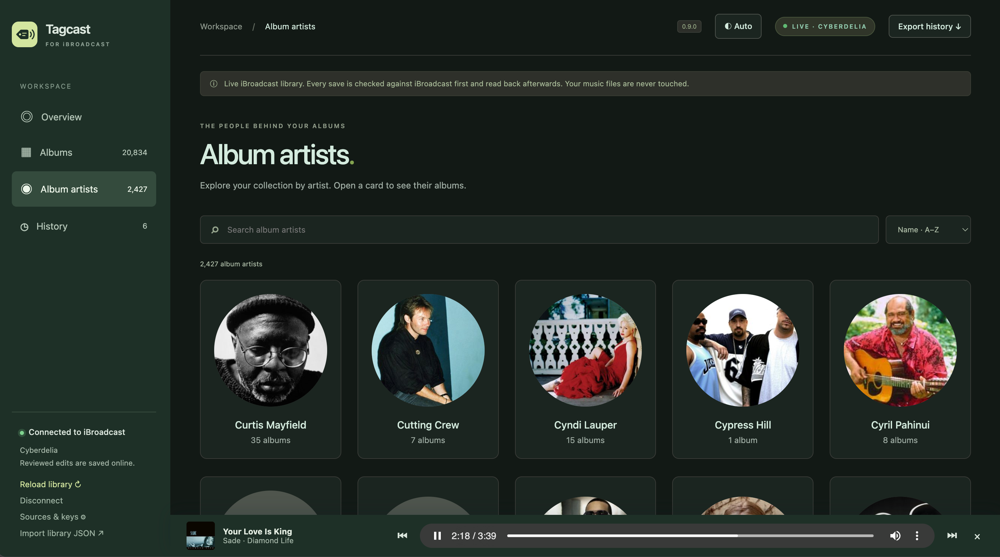
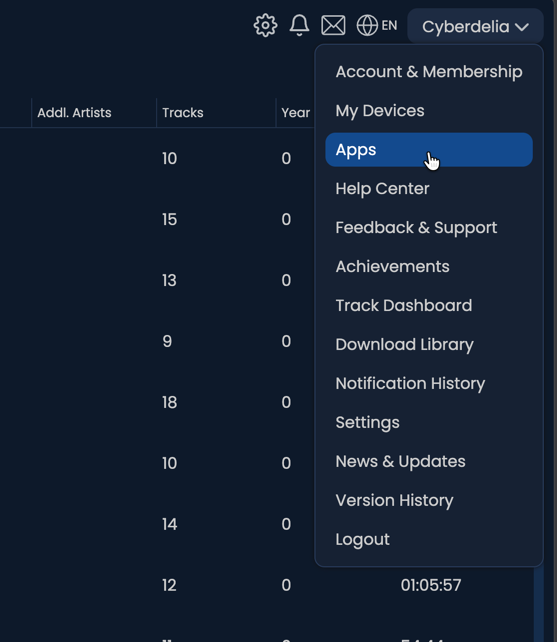
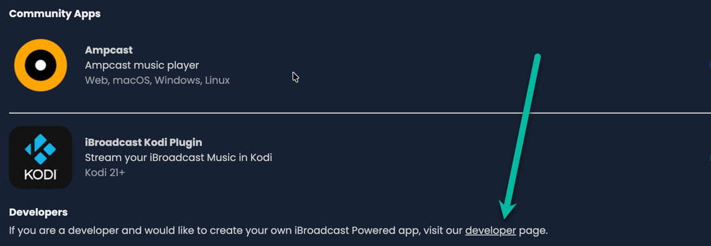
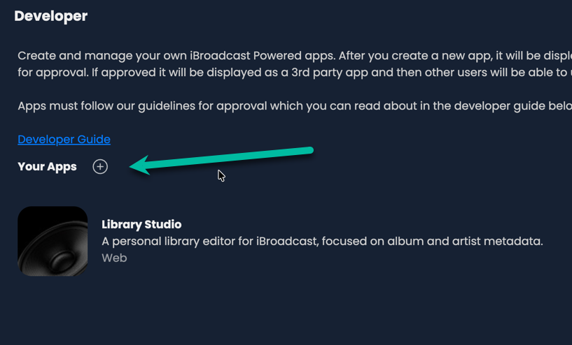
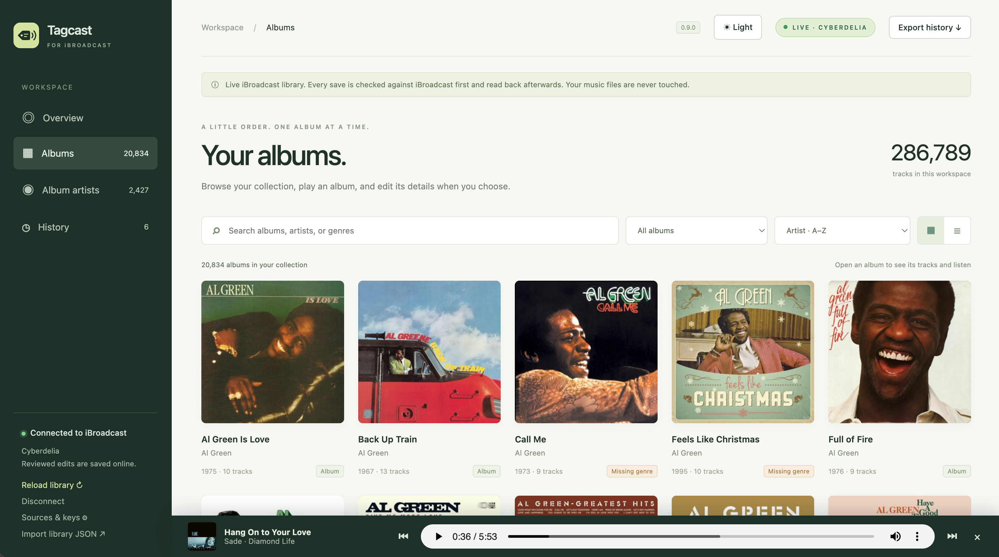
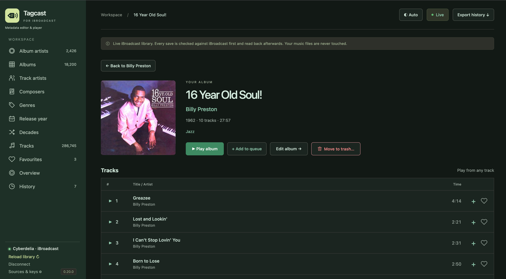
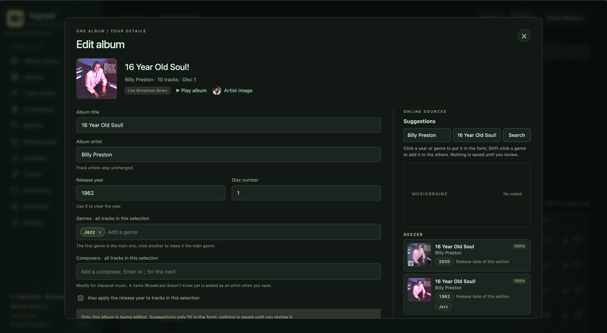
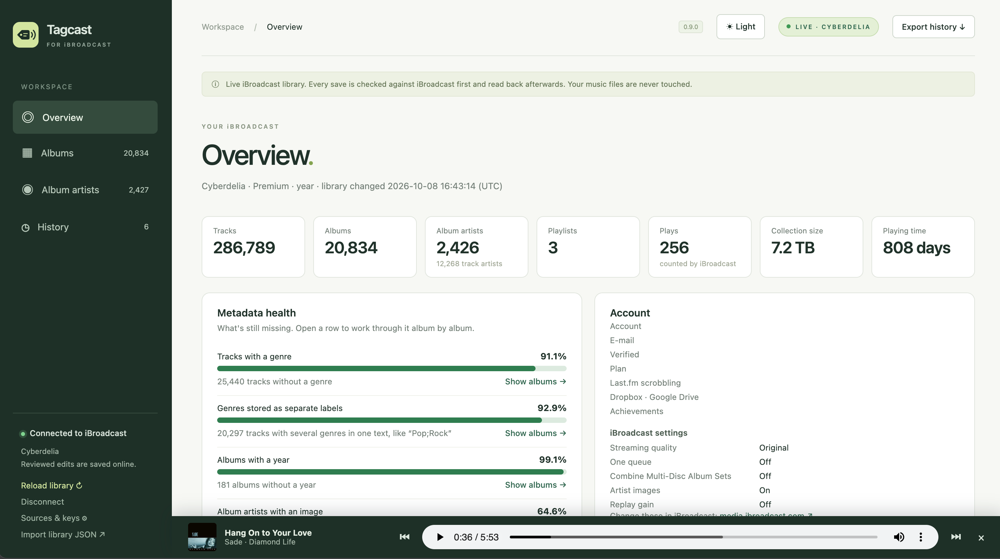

<p align="center"></p>

<h1 align="center">Tagcast</h1>
<p align="center"><b>Tag your iBroadcast library, one album at a time.</b></p>
<p align="center"><a href="https://github.com/cyberdeliaAI/tagcast/actions/workflows/tests.yml"></a> <a href="LICENSE"></a></p>

Tagcast is a local metadata editor for your [iBroadcast](https://www.ibroadcast.com/) collection: fix titles, artists, years, disc and track numbers and genres, pick covers and artist images from online sources, play what you're tagging, review every change, then save it to iBroadcast.

It runs on your computer and listens on `127.0.0.1` only. Your music files are never touched.

> **0.10.1:** desktop downloads now include a macOS **Tagcast.app**, a Windows
> launcher without a console and a Linux package, each with the existing icon,
> a separate CLI and a SHA-256 checksum. The launcher opens the browser and lets
> you stop its local server. Builds verify the extracted download before release.
> See [native builds](docs/native-builds.md).

> **0.10.0:** a new **Tracks** page searches all your tracks by title, artist,
> album or composer; play a track or open its album. The discs of a multi-disc set
> are one album with one cover. **Move to trash** removes tracks, such as
> duplicates, after a review. New filters find albums with duplicate tracks and
> album artists without an image, you choose how many items a page shows, and the
> browser's Back and Forward buttons work on every page.
> Stop any running Tagcast server before starting the updated version; otherwise
> the start script opens the existing instance. Your usual account settings remain
> available in `~/.tagcast/`, or your configured `TAGCAST_HOME`.

> Tagcast is an independent project. It is not made or endorsed by iBroadcast.



## 1. Create an iBroadcast app

Tagcast signs in with an "app" of your own, so it only gets the access you approve. You create it once, in a minute:

1. Open [media.ibroadcast.com](https://media.ibroadcast.com/) and sign in.
2. Click **your name at the top right** and choose **Apps**.

   

3. Scroll to the **bottom** of the Apps page. Under **Developers**, click the **developer** link.

   

4. Next to **Your Apps**, click **+**. Give the app a name (for example *Tagcast*) and a short description, and save it.

   

5. Open your new app and copy its **client ID**. The client secret isn't needed.

You don't need to request a review: an app you made yourself works for your own account right away.

Want to use browser sign-in instead of a code? Add `http://127.0.0.1:8912/callback` as a redirect URI in the app settings.

## 2. Run

### Standalone downloads (no Python installation)

Download the package for your system from [Releases](https://github.com/cyberdeliaAI/tagcast/releases/latest).

| System | Package ending | Start |
|---|---|---|
| macOS, Apple Silicon | `macos-arm64.zip` | Extract `Tagcast.app`, move it to Applications and open it. |
| macOS, Intel | `macos-x64.zip` | Extract `Tagcast.app`, move it to Applications and open it. |
| Windows, x64 | `windows-x64.zip` | Extract the whole folder and open `Tagcast.exe`. |
| Linux, x64 | `linux-x64.tar.gz` | Extract and run `./Tagcast` inside the `Tagcast` folder. |

From **0.10.1**, a small launcher window opens your browser. Keep it open while
using Tagcast; **Stop Tagcast and close** or closing that window stops the server
it started. An already-running server stays running. Keep the Windows/Linux
executables and `_internal` folder together.

The programs are not certificate signed. If your OS blocks them:

- macOS: **System Settings → Privacy & Security → Open Anyway**.
- Windows: **More info → Run anyway**.

Settings remain in `~/.tagcast/`, or your configured `TAGCAST_HOME`. See the
[native build guide](docs/native-builds.md) for CLI usage, checksums and platform coverage.
The older **0.10.0** downloads contain a single console program named `tagcast`
(`tagcast.exe` on Windows); close its console or use Ctrl+C to stop it.

### Run from source

**Double-click** the start script in this folder. It opens Tagcast in your browser; close its window to stop Tagcast.

| System | Start script |
|---|---|
| macOS | `start-tagcast.command` (the first time: right-click → Open if macOS asks) |
| Windows | `start-tagcast.bat` |
| Linux | `./start-tagcast.sh` |

The scripts use [uv](https://docs.astral.sh/uv/) when it's installed (set `TAGCAST_NO_UV=1` to skip it). Otherwise they need Python 3.11 or newer and, on the first start, install Tagcast in a `.venv` next to them. Starting it again while it runs just opens the running Tagcast.

Or from a terminal, with uv:

```bash
uv run tagcast --open
```

Or with plain Python 3.11+:

```bash
python3 -m venv .venv && source .venv/bin/activate
pip install -e .
tagcast --open
```

Open <http://127.0.0.1:8912>, click **Connect iBroadcast**, paste the client ID and choose **Sign in with a code**. Approve Tagcast on the iBroadcast page and your library loads.

You can also set the client ID up front: `IBROADCAST_CLIENT_ID=... uv run tagcast`.

The client ID and sign-in tokens are stored in `~/.tagcast/` (files readable by you only; settings from the earlier name, `~/.library-studio/`, are copied over on first start). Set `TAGCAST_HOME` to use a different folder. **Disconnect** revokes the token and deletes it. Use `--port` to change the port; the redirect URI changes with it.

## What it does

- **Album artists** as a searchable, paginated grid with photos or initials and
  album counts; Tagcast opens here. Choose a card to browse all albums by that artist.
- Album artists can be filtered to those **without an image**.
- Choose **24, 50, 100 or 200 per page**, for albums and for album artists separately
  (Tracks: 50, 100 or 200); Tagcast remembers it in this browser.
- **Back** works like on any website: the browser's Back and Forward buttons, and
  "← Back" on an album or artist page, return to the page you came from with its
  search, filter and page. Every page has its own address (for example `#/album/123`).
- **Albums of several discs are one album**: a 3-CD set is one card with all its
  tracks, and its album page lists the discs one after the other. See
  [Combine Multi-Disc Album Sets](#combine-multi-disc-album-sets) below.
- **Tracks**: search all your tracks at once by title, artist, album or composer.
  Case and accents don't count, so `bjork` finds Björk. Results are listed album by
  album. ▶ plays a track with the rest of its album after it; the title or album
  opens the album page with that track marked. A search shows at most 1,000 tracks.

- Loads your live iBroadcast library, with album artwork. Built for large libraries (tested with 286,000 tracks); see below.
- **Overview**: your account and iBroadcast settings, the collection in numbers (size, playing time, formats, uploads per year), what you play most, and **metadata health** (tracks without a genre, albums without a year, artists without an image, tracks without a cover), each opening the matching album filter. Payment details, IP addresses, sessions, messages and keys are never shown or sent to the page.
- Covers or a compact list. Search, and filter with counts on missing year, genre, cover or composer, artists without an image, combined genres, albums with only 1–2 tracks, albums that look incomplete (gaps in the track numbers, like 1, 2, 5), **duplicate tracks** (the same title twice in one album, ignoring case and spacing; the album page marks both copies) and named editions. **Next album** walks through a filter.
- **Composers** (handy for classical music) as labels per album or per track, saved as iBroadcast's composer credits; other credits such as featured artists stay as they are.
- Edit one album: title, album artist, year, disc number, genre for all tracks, and each track individually.
- Select albums **within one artist** and change only the fields you tick.
- **Move to trash**: on an album page, choose **Move to trash…**, tick tracks (or **Select extra copies** of duplicate tracks, or **Select all** for the whole album), review them and confirm. Tagcast first checks that the tracks are still on that album in iBroadcast, then moves them to iBroadcast's trash and reads the library back. An album without tracks disappears. Tagcast can't take tracks back out of the trash.
- **Genres as labels**: the first is the main genre, the others go to iBroadcast's additional genres, so a track shows up under each of them. Tags uploaded as one text, such as “Pop;Rock”, are marked; **Split** turns them into separate genres (per label, or **Split combined genres** for the whole album), and the **Combined genres** filter lists every album that has them.
- **Online sources** next to every album, side by side like a tag editor's tag sources: year, genres and covers from MusicBrainz (with Cover Art Archive), Deezer, Apple Music, TheAudioDB, and with your own key Discogs and Last.fm. Click a year or genre to put it in the form, Shift-click to add a genre, or **Use all**.
- **Change the album cover or the artist image**: from the sources (artist images also from fanart.tv with a key), from images iBroadcast already has, or your own file, pasted image or address. Old and new side by side, with the size.
- **Open an album** to see its cover, details, tracks and durations; play the album
  or start from a chosen track. **Edit album** opens the metadata editor.
- Review before/after values, then **Save to iBroadcast**. History keeps every save in this browser, and a cover or image change can be undone.
- Light and dark theme: **Auto** follows your system; the button at the top switches to Light or Dark.
- Without an account it still runs with demo data, which is never saved online.

### Screenshots

The workspace screenshots below show **0.9.0**. They illustrate browsing,
playback and editing; the current version also has Tracks, multi-disc sets,
trash review and the updated sidebar described above.

**Browse albums** in the light theme: search your collection, filter missing metadata and switch between covers and a compact list. Playback continues while browsing.



**Open an album** to see its cover, track list and durations. Play the album or start from any track; choose **Edit album** to open the metadata editor. The player can keep playing another album while you browse.



**Edit an album** with suggestions from MusicBrainz, Deezer, Apple Music and more next to it. Edit genres and composers as labels. A click puts a suggested year or genre in the form; nothing is saved until you review it.



**Overview**: the collection in numbers and its metadata health, with links to the albums to fix (light theme).



**Pick an artist image or cover** from the sources, from images iBroadcast already has, or from your own file, and compare it with the current one.


**Review before saving**: every change, album and track, before and after. Tagcast checks iBroadcast first and reads the result back afterwards.


### Online sources and keys

MusicBrainz, Deezer, Apple Music (iTunes Search) and TheAudioDB work without a key. For the others, open **Sources & keys** in the sidebar:

| Source | What it adds | Key |
|---|---|---|
| Discogs | Styles and genres, original year, covers, artist images | Personal token: Discogs → Settings → Developers |
| Last.fm | Listener tags as genres, covers | API key: [last.fm/api/account/create](https://www.last.fm/api/account/create) |
| fanart.tv | Artist images | Personal API key: [fanart.tv/get-an-api-key](https://fanart.tv/get-an-api-key/) |

Keys are stored in `~/.tagcast/config.json` (readable by you only) or come from `DISCOGS_TOKEN`, `LASTFM_API_KEY` and `FANART_API_KEY`. They are never sent to the page.

By default an album is looked up in all sources when you open it; turn that off in **Sources & keys**. A lookup sends the artist and album name to each source. Requests are spaced per source (MusicBrainz once a second, Apple Music every 3 seconds, and so on) and answers are cached for an hour.

Matching ignores case, accents, "The", and edition text such as "(2011 Remaster)" or "- Deluxe Edition"; each suggestion shows how well title and artist match. MusicBrainz and Discogs give the **first release** year; Deezer and Apple Music give the date of the edition they have, which for a remaster is the remaster's date.

### Large libraries

iBroadcast can only send the whole library at once (about 92 MB and 20–30 seconds for 286,000 tracks). Tagcast downloads it only when something changed:

- Each load first asks iBroadcast when the library last changed (`lastmodified` from the `status` call, the same signal the web player uses). If that matches the copy Tagcast has, the copy is used: from memory (under a second) or from `~/.tagcast/library-cache.json.gz` after a restart (about 2 seconds).
- The cache holds only library metadata (tracks, albums, artists), no account details. It is readable by you only and deleted when you **Disconnect**. **Download everything again** in the account dialog skips the check.
- The browser gets a small list of albums (about 5 MB for 18,000 albums). Tracks are fetched when you open an album.
- A track search runs on the server, in the library it already holds, and sends back only the matches. It asks iBroadcast for nothing. The first search after a download builds a search list: about 2 seconds and 50 MB for 288,000 tracks (measured on a generated library); later searches take about a tenth of a second.

The server keeps the library in memory: count on roughly 750 MB for 286,000 tracks.

### How saving stays safe

1. The server checks your library against iBroadcast and compares every "before" value with it. If anything changed in iBroadcast since you loaded it, **nothing is written** and you're asked to reload. When iBroadcast reports no change since the last download, the copy in memory is used for this check; otherwise a fresh copy is downloaded first.
2. Artist names are matched to existing artists (exact name first, then case-insensitive). A name that doesn't exist yet is shown as a warning in the review and created with `create_artist` when you save.
3. Changes are sent with `update_album` and `update_track`, grouped like the official web editor does. Only the changed fields are sent.
4. The library is **downloaded again and read back** and every record is reported as *Saved*, *Not confirmed* or *Failed*. If one request fails, later requests are not sent. With a large library this read-back takes about as long as a full download.

Album year changes leave track years alone unless you tick that option. Individual track edits win over album-wide changes.

Network errors, HTTP 429 and 5xx answers are retried twice (after 2 and 6 seconds); creating an artist is never retried, so it can't happen twice. When iBroadcast refuses a change, its message is shown in the results and in History, and logged with the request in the terminal and in `~/.tagcast/tagcast.log`.

Saving returns as soon as iBroadcast accepts the change. The read-back runs in the background (**Checking…** in History) and the next save reuses that download.

### Combine Multi-Disc Album Sets

**Keep this iBroadcast setting off.** Tagcast then shows a set of several discs as one album and can save every change to it. The iBroadcast apps show each disc as its own album; only the setting changes that.

Why: while the setting is on, iBroadcast merges the discs of a set into one album in the library it sends (disc 1, holding the tracks of every disc), and refuses album changes (title, album artist, year, disc). Tagcast can't switch the setting itself. With the setting off, each disc is its own album in iBroadcast.

- **Setting off:** discs with the same title and album artist and different disc numbers are one album in Tagcast: one card in the lists (a CD icon per disc, with all tracks counted), one album page with the discs one after the other, and **Play album** plays them all. **Edit album** changes the title, album artist, year, genres or composers of every disc at once; the review lists the change per disc, because iBroadcast gets it once per disc. **Change cover** there puts one cover on every disc: the image is uploaded once and then set disc by disc, with a History entry per disc, so **Undo** works per disc. With a large library each disc waits for the read-back of the disc before. A disc number is changed per disc, with **Edit disc 2** on the album page. Discs whose titles differ, such as “Album (CD1)” and “Album (CD2)”, are not recognised as a set. The Overview counts albums as iBroadcast does, every disc separately.
- **Setting on:** Tagcast warns in the review, still saves the track changes (genres, track years) and marks the album changes *Not sent · setting*. To save them, turn the setting off in iBroadcast and use **Review the rest again** in the results or History.
- The cached library belongs to the setting it was downloaded with, so switching the setting makes Tagcast download the library again.

### Covers and artist images

An image is checked before it's sent: JPEG, PNG, WebP or GIF, at most 15 MB. Images from an address are downloaded by Tagcast (not by iBroadcast), and addresses on this computer or the local network are refused.

The image is uploaded to iBroadcast's artwork store, then applied with `set_artwork` (all tracks of the album, which is what iBroadcast shows as the album cover) or `set_artist_artwork`. Before anything is written, the current artwork is compared with what you saw; afterwards it is read back. **Undo** in History puts the previous artwork back, track by track.

### Playback

Audio is passed through the local server (`/api/stream/<track>`), so the iBroadcast token stays out of the page. Seeking works. Plays are not reported to iBroadcast (no play counts or scrobbles).

## API notes

Built on [ibroadcast-python](https://github.com/ctrueden/ibroadcast-python) for OAuth (device code and PKCE authorization code flows), token refresh and the request format.

The [public API reference](https://help.ibroadcast.com/en/developer/api) documents reading the library, tags, playlists and ratings; `trash` (tracks to the trash) is part of ibroadcast-python. Metadata writes (`update_album`, `update_track`, `create_artist`) and artwork (`artwork-upload.ibroadcast.com`, `set_artwork`, `set_artist_artwork`, `get_artwork`) come from the official [web editor script](https://media.ibroadcast.com/js/iBroadcastLibraryEditor.js), inspected on 2026-10-04. Streaming follows the web player: `streaming.ibroadcast.com` plus the track's `file`, signed with the access token. These aren't documented publicly, so:

- year and disc are sent as strings, the way the web editor sends input values; track number is sent as `track_no`;
- the app requests the scopes `user.library:read`, `user.library:write` and `user.account:read`;
- if iBroadcast refuses a write mode for third-party apps, the save reports **Failed** with iBroadcast's message and nothing else is sent.

Tested against a real account (286,789 tracks): loading, caching, `update_track`
(genre), streaming and `get_artwork`. The 0.10.0 release notes also record track
search, disc sets and trash being tried on a real library. Automated write tests
use the fake iBroadcast server (`tests/mock_ibroadcast.py`); they do not establish
live-service compatibility. Artwork upload and `set_artwork` / `set_artist_artwork`
have only documented mock coverage. **Undo** in Tagcast applies to covers and
artist images; Tagcast cannot restore tracks from trash.

## Styles

`static/dark.css` is generated from `static/style.css` by `tools/build_dark_css.py`: each colour keeps its hue and gets a dark-theme lightness, and a few surfaces are set by hand. Run `python3 tools/build_dark_css.py` after changing `style.css`; a test fails when you forget.

## Tests

```bash
uv run --frozen pytest -q
uv run --frozen ruff check src tests tools
python3 tools/release_info.py
# Without uv:
PYTHONPATH=src python3 -m unittest discover -s tests -v
for f in src/tagcast/static/*.js; do node --check "$f"; done
node --test tests/frontend.test.cjs
```

To click through the full flow without a real account:

```bash
python3 tests/mock_ibroadcast.py 9555 &
TAGCAST_IBROADCAST_BASE=http://127.0.0.1:9555 TAGCAST_HOME=/tmp/ls-test \
  IBROADCAST_CLIENT_ID=test PYTHONPATH=src python3 -m tagcast.app
```

## Not in scope

Automatic changes without review (every suggestion goes through you), uploading music, deleting for good (Tagcast only moves tracks to iBroadcast's trash), renaming an artist in place (iBroadcast has no mode for it: a new name creates a new artist), and editing local files.

## Development credits

Developed by Cyberdelia, with AI-assisted development using Claude (Anthropic)
and ChatGPT / Codex (OpenAI).

## License

[MIT](LICENSE). Tagcast is an independent project and not affiliated with iBroadcast.
