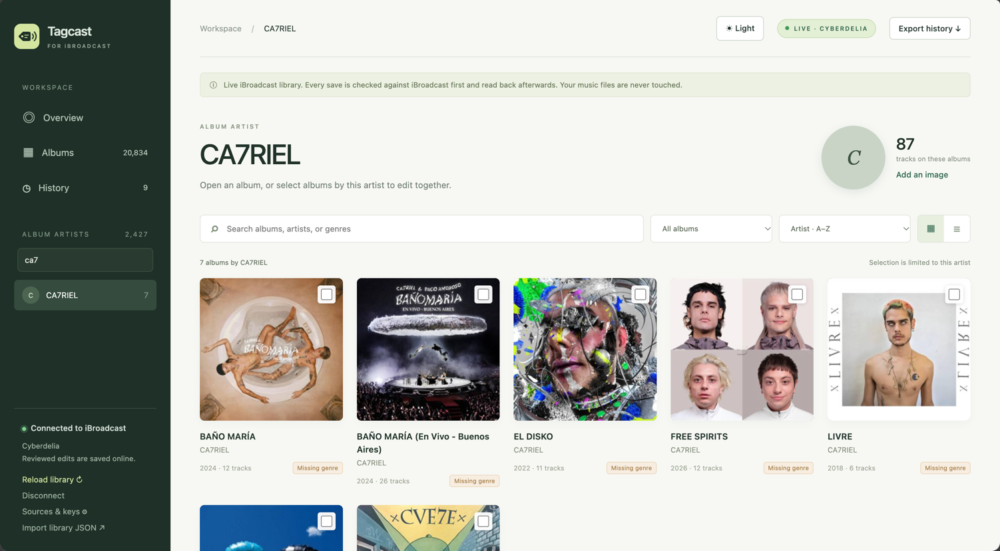
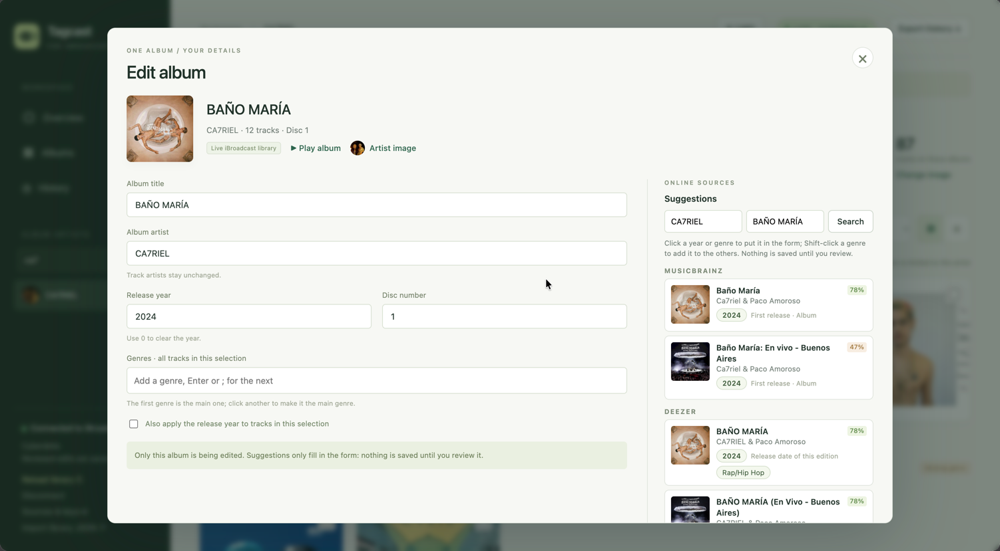
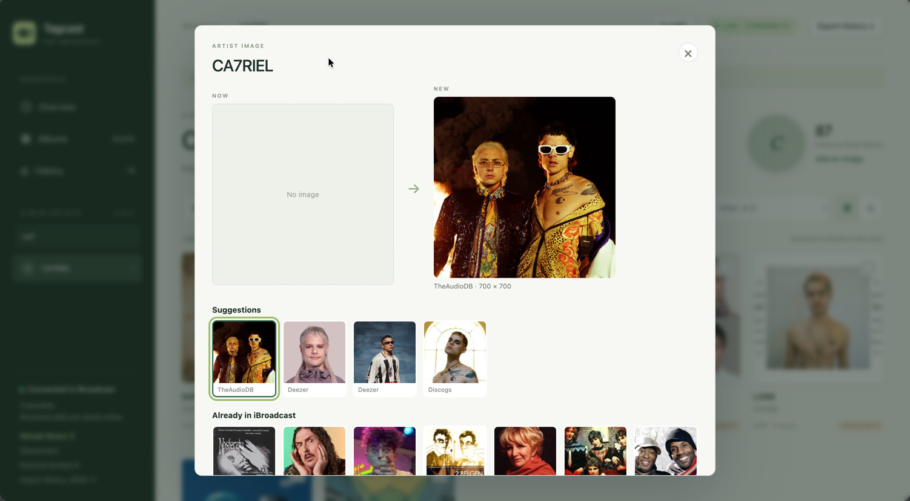
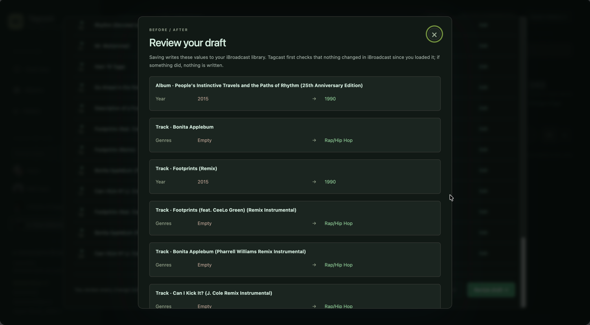
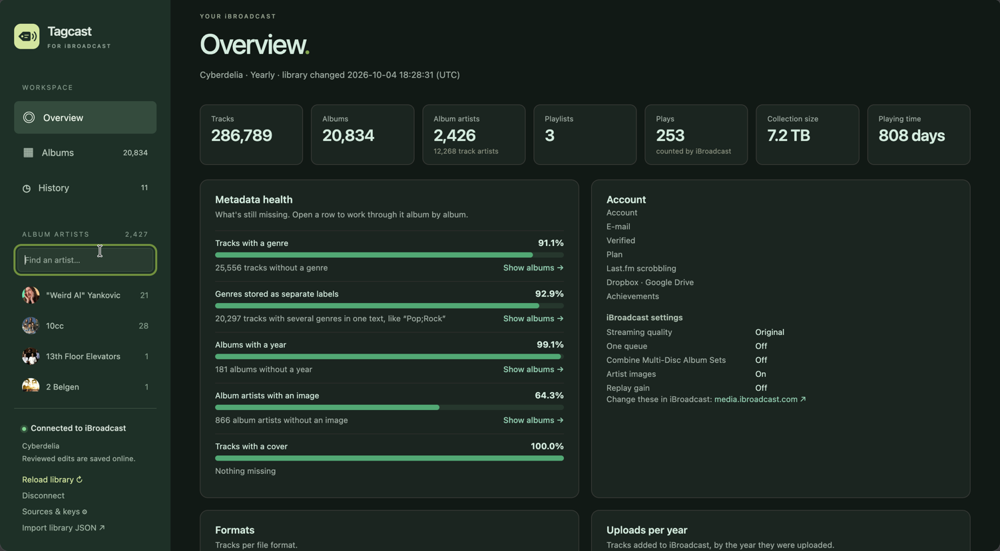

<p align="center"></p>

<h1 align="center">Tagcast</h1>
<p align="center"><b>Tag your iBroadcast library, one album at a time.</b></p>

Tagcast is a local metadata editor for your [iBroadcast](https://www.ibroadcast.com/) collection: fix titles, artists, years, disc and track numbers and genres, pick covers and artist images from online sources, play what you're tagging, review every change, then save it to iBroadcast.

It runs on your computer and listens on `127.0.0.1` only. Your music files are never touched.

> Tagcast is an independent project. It is not made or endorsed by iBroadcast.



## 1. Create an iBroadcast app

1. Open [media.ibroadcast.com](https://media.ibroadcast.com/), open the side menu and choose **Apps**.
2. Click **Developer** at the bottom and create an app.
3. Copy the **client ID**. The client secret isn't needed.

Want to use browser sign-in instead of a code? Add `http://127.0.0.1:8912/callback` as a redirect URI in the app settings.

## 2. Run

**Double-click** the start script in this folder. It opens Tagcast in your browser; close its window to stop Tagcast.

| System | Start script |
|---|---|
| macOS | `start-tagcast.command` (the first time: right-click → Open if macOS asks) |
| Windows | `start-tagcast.bat` |
| Linux | `./start-tagcast.sh` |

The scripts use [uv](https://docs.astral.sh/uv/) when it's installed. Otherwise they need Python 3.11 or newer and, on the first start, install Tagcast in a `.venv` next to them. Starting it again while it runs just opens the running Tagcast.

Or from a terminal, with uv:

```bash
uv run tagcast --open
```

Or with plain Python 3.11+:

```bash
python3 -m venv .venv && source .venv/bin/activate
pip install -e .
tagcast --open
```

Open <http://127.0.0.1:8912>, click **Connect iBroadcast**, paste the client ID and choose **Sign in with a code**. Approve Tagcast on the iBroadcast page and your library loads.

You can also set the client ID up front: `IBROADCAST_CLIENT_ID=... uv run tagcast`.

The client ID and sign-in tokens are stored in `~/.tagcast/` (files readable by you only; settings from the earlier name, `~/.library-studio/`, are copied over on first start). Set `TAGCAST_HOME` to use a different folder. **Disconnect** revokes the token and deletes it. Use `--port` to change the port; the redirect URI changes with it.

## What it does

- Loads your live iBroadcast library, with album artwork. Built for large libraries (tested with 286,000 tracks); see below.
- **Overview**: your account and iBroadcast settings, the collection in numbers (size, playing time, formats, uploads per year), what you play most, and **metadata health** (tracks without a genre, albums without a year, artists without an image, tracks without a cover), each opening the matching album filter. Payment details, IP addresses, sessions, messages and keys are never shown or sent to the page.
- Covers or a compact list. Search, and filter on missing year, missing genre, artist without image or named editions, with counts. **Next album** walks through a filter.
- Edit one album: title, album artist, year, disc number, genre for all tracks, and each track individually.
- Select albums **within one artist** and change only the fields you tick.
- **Genres as labels**: the first is the main genre, the others go to iBroadcast's additional genres, so a track shows up under each of them. Tags uploaded as one text, such as “Pop;Rock”, are marked; **Split** turns them into separate genres (per label, or **Split combined genres** for the whole album), and the **Combined genres** filter lists every album that has them.
- **Online sources** next to every album, side by side like a tag editor's tag sources: year, genres and covers from MusicBrainz (with Cover Art Archive), Deezer, Apple Music, TheAudioDB, and with your own key Discogs and Last.fm. Click a year or genre to put it in the form, Shift-click to add a genre, or **Use all**.
- **Change the album cover or the artist image**: from the sources (artist images also from fanart.tv with a key), from images iBroadcast already has, or your own file, pasted image or address. Old and new side by side, with the size.
- **Play** an album or a track to check what you're tagging.
- Review before/after values, then **Save to iBroadcast**. History keeps every save in this browser, and a cover or image change can be undone.
- Light and dark theme: **Auto** follows your system; the button at the top switches to Light or Dark.
- Without an account it still runs with demo data, or with an imported library JSON. Those are never saved online.

### Screenshots

**Edit an album** with suggestions from MusicBrainz, Deezer, Apple Music and more next to it. A click puts a year or genre in the form; nothing is saved until you review it.



**Pick an artist image or cover** from the sources, from images iBroadcast already has, or from your own file, and compare it with the current one.



**Review before saving**: every change, album and track, before and after. Tagcast checks iBroadcast first and reads the result back afterwards.



**Overview**: the collection in numbers and its metadata health, each row opening the albums to fix (dark theme).



### Online sources and keys

MusicBrainz, Deezer, Apple Music (iTunes Search) and TheAudioDB work without a key. For the others, open **Sources & keys** in the sidebar:

| Source | What it adds | Key |
|---|---|---|
| Discogs | Styles and genres, original year, covers, artist images | Personal token: Discogs → Settings → Developers |
| Last.fm | Listener tags as genres, covers | API key: [last.fm/api/account/create](https://www.last.fm/api/account/create) |
| fanart.tv | Artist images | Personal API key: [fanart.tv/get-an-api-key](https://fanart.tv/get-an-api-key/) |

Keys are stored in `~/.tagcast/config.json` (readable by you only) or come from `DISCOGS_TOKEN`, `LASTFM_API_KEY` and `FANART_API_KEY`. They are never sent to the page.

By default an album is looked up in all sources when you open it; turn that off in **Sources & keys**. A lookup sends the artist and album name to each source. Requests are spaced per source (MusicBrainz once a second, Apple Music every 3 seconds, and so on) and answers are cached for an hour.

Matching ignores case, accents, "The", and edition text such as "(2011 Remaster)" or "- Deluxe Edition"; each suggestion shows how well title and artist match. MusicBrainz and Discogs give the **first release** year; Deezer and Apple Music give the date of the edition they have, which for a remaster is the remaster's date.

### Large libraries

iBroadcast can only send the whole library at once (about 92 MB and 20–30 seconds for 286,000 tracks). Tagcast downloads it only when something changed:

- Each load first asks iBroadcast when the library last changed (`lastmodified` from the `status` call, the same signal the web player uses). If that matches the copy Tagcast has, the copy is used: from memory (under a second) or from `~/.tagcast/library-cache.json.gz` after a restart (about 2 seconds).
- The cache holds only library metadata (tracks, albums, artists), no account details. It is readable by you only and deleted when you **Disconnect**. **Download everything again** in the account dialog skips the check.
- The browser gets a small list of albums (about 5 MB for 18,000 albums). Tracks are fetched when you open an album.

The server keeps the library in memory: count on roughly 750 MB for 286,000 tracks.

### How saving stays safe

1. The server checks your library against iBroadcast and compares every "before" value with it. If anything changed in iBroadcast since you loaded it, **nothing is written** and you're asked to reload. When iBroadcast reports no change since the last download, the copy in memory is used for this check; otherwise a fresh copy is downloaded first.
2. Artist names are matched to existing artists (exact name first, then case-insensitive). A name that doesn't exist yet is shown as a warning in the review and created with `create_artist` when you save.
3. Changes are sent with `update_album` and `update_track`, grouped like the official web editor does. Only the changed fields are sent.
4. The library is **downloaded again and read back** and every record is reported as *Saved*, *Not confirmed* or *Failed*. If one request fails, later requests are not sent. With a large library this read-back takes about as long as a full download.

Album year changes leave track years alone unless you tick that option. Individual track edits win over album-wide changes.

**“Combine Multi-Disc Album Sets”**: while this iBroadcast setting is on, iBroadcast merges the discs of a set into one album in the library it sends (disc 1, holding the tracks of every disc), and refuses album changes (title, album artist, year, disc). With the setting off, each disc is its own album, in Tagcast and in every iBroadcast app.

- With the setting on, Tagcast warns in the review, still saves the track changes (genres, track years) and marks the album changes *Not sent · setting*. Turn the setting off in iBroadcast and use **Review the rest again** in the results or History.
- With it off, albums of one set show *Disc 1 of 3*, and **Edit all 3 discs together** in the editor changes the year, genre or album artist of the whole set at once.
- The cached library belongs to the setting it was downloaded with, so switching the setting makes Tagcast download the library again.

Network errors, HTTP 429 and 5xx answers are retried twice (after 2 and 6 seconds); creating an artist is never retried, so it can't happen twice. When iBroadcast refuses a change, its message is shown in the results and in History, and logged with the request in the terminal and in `~/.tagcast/tagcast.log`.

Saving returns as soon as iBroadcast accepts the change. The read-back runs in the background (**Checking…** in History) and the next save reuses that download.

### Covers and artist images

An image is checked before it's sent: JPEG, PNG, WebP or GIF, at most 15 MB. Images from an address are downloaded by Tagcast (not by iBroadcast), and addresses on this computer or the local network are refused.

The image is uploaded to iBroadcast's artwork store, then applied with `set_artwork` (all tracks of the album, which is what iBroadcast shows as the album cover) or `set_artist_artwork`. Before anything is written, the current artwork is compared with what you saw; afterwards it is read back. **Undo** in History puts the previous artwork back, track by track.

### Playback

Audio is passed through the local server (`/api/stream/<track>`), so the iBroadcast token stays out of the page. Seeking works. Plays are not reported to iBroadcast (no play counts or scrobbles).

## API notes

Built on [ibroadcast-python](https://github.com/ctrueden/ibroadcast-python) for OAuth (device code and PKCE authorization code flows), token refresh and the request format.

The [public API reference](https://help.ibroadcast.com/en/developer/api) documents reading the library, tags, playlists and ratings. Metadata writes (`update_album`, `update_track`, `create_artist`) and artwork (`artwork-upload.ibroadcast.com`, `set_artwork`, `set_artist_artwork`, `get_artwork`) come from the official [web editor script](https://media.ibroadcast.com/js/iBroadcastLibraryEditor.js), inspected on 2026-10-04. Streaming follows the web player: `streaming.ibroadcast.com` plus the track's `file`, signed with the access token. These aren't documented publicly, so:

- year and disc are sent as strings, the way the web editor sends input values; track number is sent as `track_no`;
- the app requests the scopes `user.library:read`, `user.library:write` and `user.account:read`;
- if iBroadcast refuses a write mode for third-party apps, the save reports **Failed** with iBroadcast's message and nothing else is sent.

Tested against a real account (286,789 tracks): loading, caching, `update_track` (genre), streaming and `get_artwork`. Artwork upload and `set_artwork` / `set_artist_artwork` are tested against the fake iBroadcast server (`tests/mock_ibroadcast.py`) only: try one album first, and use **Undo** if it isn't right.

## Styles

`static/dark.css` is generated from `static/style.css` by `tools/build_dark_css.py`: each colour keeps its hue and gets a dark-theme lightness, and a few surfaces are set by hand. Run `python3 tools/build_dark_css.py` after changing `style.css`; a test fails when you forget.

## Tests

```bash
uv run --with pytest pytest          # or:
PYTHONPATH=src python3 -m unittest discover -s tests -v
for f in src/tagcast/static/*.js; do node --check "$f"; done
```

To click through the full flow without a real account:

```bash
python3 tests/mock_ibroadcast.py 9555 &
TAGCAST_IBROADCAST_BASE=http://127.0.0.1:9555 TAGCAST_HOME=/tmp/ls-test \
  IBROADCAST_CLIENT_ID=test PYTHONPATH=src python3 -m tagcast.app
```

## Not in scope

Automatic changes without review (every suggestion goes through you), uploading music, deleting, renaming an artist in place (iBroadcast has no mode for it: a new name creates a new artist), and editing local files.

## License

[MIT](LICENSE). Tagcast is an independent project and not affiliated with iBroadcast.
